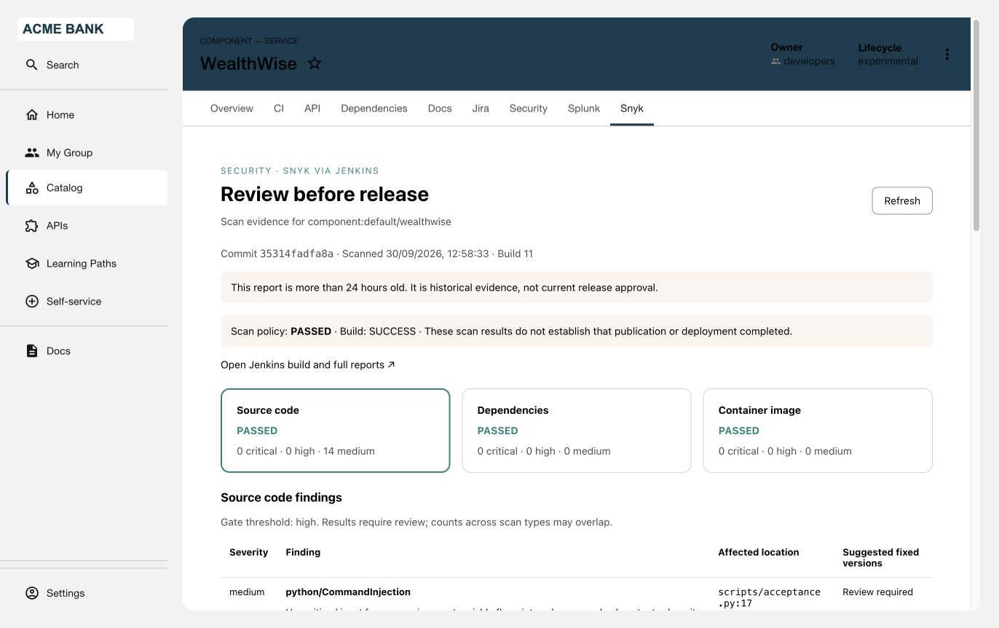

# Validation — 1 October 2026

| Plugin | Build and automated checks | Live installation |
|---|---|---|
| Jenkins Stage Progress & Logs 0.1.1 | 8 backend behavior tests, TypeScript check, frontend export, backend bundle and real loader test | Pending |
| Snyk Security 0.2.0 | 12 backend authorization/report tests, 9 pipeline tests, 4 frontend state tests, TypeScript check, frontend export, backend bundle and real loader test | Passed: RHDH 1.10.4 + Jenkins reports |

Snyk 0.2.0 frontend and backend archives were installed in RHDH 1.10.4.
The authenticated tab displayed real Jenkins build 11, the matching commit,
three scan-policy outcomes, 14 medium source findings, image archive SHA-256,
stale-evidence notice and a build link. The report was read from the numeric build's
artifact after verifying Jenkins SCM metadata. Anonymous API access returned 401.
Mounted-report mode, denial paths and malformed evidence are covered by automated
tests; a complete live RBAC persona matrix and a new scan execution were not run.



Snyk Security displaying build-linked scan evidence in Red Hat Developer Hub.

Live installation validation of the packaged Jenkins dynamic plugin has not yet
been completed. Jenkins behavior and package-loader tests passed.

## Versions and packaging

- Build runtime: Node **24.19.0**; frontend RHDH CLI **2.0.0**; TypeScript **5.8.3**.
- Backend host peer: `@backstage/backend-plugin-api` **1.8.0**.
- Loader exercised: `@backstage/backend-dynamic-feature-service` **0.8.0**, using
  `CommonJSModuleLoader.bootstrap/load`, the real backend feature registrations,
  and real Express router initialization. This is a package smoke test, not a full
  RHDH server boot or cluster deployment.
- Express **4.22.1**, patched query parser qs **6.16.0**, and private dependencies are bundled by esbuild **0.25.12**.
  Build verification rejects unexpected external runtime imports. Release archives
  retain only the explicit Backstage backend API peer; no host Express is assumed.
  Backend archives include the actual private dependency list and license texts.
- Frontend shared dependencies: React **18.3.1**, Backstage core-plugin-api **1.11.0**,
  plugin-catalog-react **1.21.0**, catalog-model **1.7.7**, react-router-dom **6.30.6**.
- Target baseline: RHDH **1.10.4**. Jenkins service baseline **2.568.3**, Pipeline REST API
  **2.41**. Requalify host-shared dependency compatibility on other RHDH versions.
- Report schema **1**; pipeline scripts use Python **3** and Snyk CLI JSON/SARIF.

## Reproduce

Run each command separately from the repository root:

```sh
bash scripts/build.sh jenkins-stage-progress
bash scripts/build.sh snyk-security
```

Tests include denied access, mapping checks, malformed/oversized upstream responses,
truncated findings, safe errors, refresh behavior and stale-response handling. Build
output includes SHA-256 checksums and SHA-512 installation integrity values.
Follow each plugin's verification section for the remaining live checks.

## Repository checks

Gitleaks **8.30.1** reported no findings in the current source files, packaged archives or reachable
Git history. Tracked-text checks passed. These checks reduce risk; they do not certify the absence of every
possible secret or vulnerability. Dependency audit results describe development
and host-shared packages as well as runtime code; review them for the target host.

Dependency audit: both frontend trees report 0 critical, 0 high, 44 moderate and
5 low findings. The shared build/test tree retains four high advisories through
its RHDH loader's Infinispan/urllib/undici dependency chain. Those packages are not
bundled in either backend archive and are not called by the loader smoke test.
The loader version remains pinned for compatibility testing; replacing it with a
different version requires requalification. The Express query-parser advisory was
resolved by pinning its bundled qs dependency to 6.16.0.
