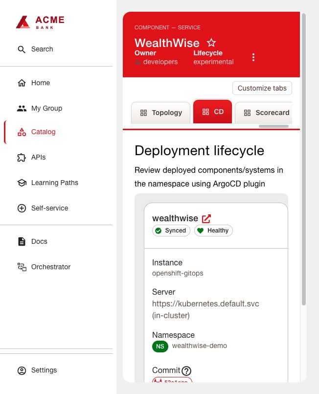

# Argo CD

The native community frontend/backend display sync, health and the deployed Git
revision. Install [shared configuration](../INSTALL.md) using this directory's
`dynamic-plugins.json` and `app-config.yaml`.

## Configure GitOps and access

1. Install Red Hat OpenShift GitOps from OperatorHub; wait for the Argo CD instance
   and server route. Create your application namespace and permit that Argo instance
   to manage it (for the standard instance, label the namespace
   `argocd.argoproj.io/managed-by=openshift-gitops`). Confirm its service account has
   the necessary namespace roles. The portal reader is a separate identity.
2. In Argo CD Settings → Repositories, connect your GitOps repository using its
   repository credential. Commit reviewed Deployment, Service, Route and NetworkPolicy
   manifests under `applications/example-app`. Keep database/PVC/Secret ownership
   with their existing managers unless explicitly migrating them to GitOps.
3. Replace the placeholders in [application.yaml](application.yaml), then apply it
   in your Argo namespace. The example disables pruning and enables self-healing.
   Wait for Synced/Healthy before configuring the portal.
4. Configure an Argo local account `rhdh-reader` with `apiKey` capability. On an
   Operator-managed instance, configure accounts and RBAC through its ArgoCD CR
   (`spec.extraConfig` and `spec.rbac`) so reconciliation preserves them. Grant only
   the desired project, for example:
   ```csv
   p, role:rhdh-reader, applications, get, example-app/*, allow
   g, rhdh-reader, role:rhdh-reader
   ```
   Log in with the Argo CLI as an administrator and generate a bounded token:
   `argocd account generate-token --account rhdh-reader --expires-in 720h`.
   Save the result privately as `ARGOCD_TOKEN`; renew before its 30-day expiry.
5. Configure the route URL, instance name and token in RHDH using the shared guide.
   Trust the server certificate through the backend CA bundle when required.
6. Add to the existing catalog Component:
   ```yaml
   argocd/app-name: example-app
   argocd/instance-name: openshift-gitops
   ```
   For namespaced application lookup, also supply `argocd/app-namespace` if required
   by your Argo installation. Register `argocd` in RBAC `pluginsWithPermission` and
   grant `p, role:default/developer, argocd.view.read, read, allow` to the intended role.

## Delivery pipeline and acceptance

After tests/security gates, Jenkins publishes an immutable image digest and commits
that digest to the GitOps manifest. Argo performs deployment; Jenkins can wait for
that exact Git revision and rollout. Stop competing direct deployment commands for
resources now managed by Argo. Revert Git for rollback instead of `oc rollout undo`.

Open the **CD** tab. Confirm the revision matches Git, health is Healthy and sync is
Synced; make a controlled Git change and observe reconciliation. A passing Jenkins
build alone does not prove that Argo deployed the revision.

Optional compact card: enable `argocd` in [Application Overview](../../plugins/application-health/README.md).
The detailed CD tab does not require the custom card.


