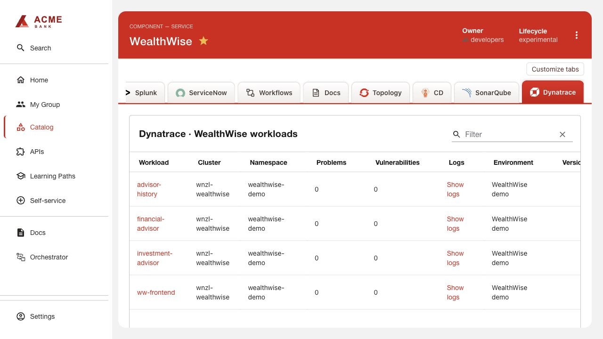

# Dynatrace

Source: vendor-maintained Dynatrace DQL Backstage plugins.

The configured frontend/backend version is 2.7.0, exported for Backstage 1.49.4.
The native tab displays instrumented Kubernetes deployments. There is no custom
Dynatrace compact card in Application Overview.

## Tenant and instrumentation

1. Use a Dynatrace tenant with Kubernetes/application observability and DQL access.
   In Account Management create a client-credentials OAuth client with
   `storage:buckets:read`, `storage:entities:read`, `storage:events:read`,
   `storage:metrics:read` and `storage:security.events:read`. Its subject also needs
   access to the environment. Retain the client ID, secret and account URN privately.
2. If workloads are not instrumented, use Kubernetes → Add cluster to configure
   OpenShift Kubernetes monitoring and Application observability. Restrict injection
   to the application namespaces. Follow the tenant-generated Operator/DynaKube
   instructions for images, capacity and token permissions; the Operator token is
   separate from portal OAuth credentials.
3. Roll out the selected workloads to inject instrumentation and confirm they appear
   in Dynatrace. Namespace selection limits application injection, not the Operator's
   Kubernetes monitoring permissions. Log ingestion is configured independently.

## RHDH configuration

Follow [shared installation](../INSTALL.md) with `dynamic-plugins.json`,
`app-config.yaml` and the three `DYNATRACE_*` backend variables. Use the `.apps`
environment URL for DQL, not the `.live` Operator API URL. Add Component annotations
matching the workload labels and namespace:

```yaml
backstage.io/kubernetes-id: example-app
backstage.io/kubernetes-namespace: example-app
```

Refresh the entity and open **Dynatrace**. OAuth failures can indicate missing
subject access or client scopes. Show logs links require log ingestion; installing
the portal plugin does not enable collection. Renew credentials and time-limited
entitlements before expiry.

[Dynatrace application observability](https://docs.dynatrace.com/docs/ingest-from/setup-on-k8s/deployment/application-observability)


