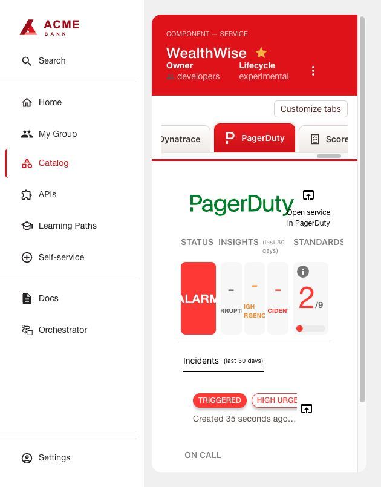

# PagerDuty

Source: vendor-maintained PagerDuty Backstage plugins.

The native PagerDuty tab shows service incidents and on-call details. It is read-only
in this setup. Dynatrace supplies problem events; PagerDuty handles escalation.
Configured exports: frontend 0.19.0/backend 0.12.0 for Backstage 1.49.4, RHDH 1.10.4.

## Service and monitoring workflow

1. Create a PagerDuty service, escalation policy and available responder. Add its
   **Dynatrace** integration. Record the service ID and keep the Events routing key
   private. Configure responder notification methods for your intended demo audience.
2. Under Integrations → API Access Keys create a read-only API key for RHDH. This
   differs from the Events routing key: only the API key goes to the portal.
3. In Dynatrace Settings → Connections → PagerDuty → Events API, add a connection
   for `https://events.pagerduty.com/v2/enqueue` with the routing key. Allow the exact
   host `events.pagerduty.com` under General → External requests.
4. In Workflows create from **Send problem as event to PagerDuty**. Choose the
   connection, active or closed problems, all categories, severity Minor (3) or more
   severe, minimum duration appropriate to your alerting policy, and root-cause analysis. Set
   the application filter, replacing the namespace:
   ```dql
   matchesValue(k8s.namespace.name, "example-app")
   ```
   Keep the template's stable environment/problem deduplication key and mapping
   ACTIVE → trigger, CLOSED → resolve. Deploy the workflow.
5. In Workflows → Authorization settings, authorize the actor for
   `app-engine:apps:run`, `app-engine:functions:run`, `app-settings:objects:read`.
   The actor must already hold these permissions. Account policies may require additional permissions.

## RHDH tab

Follow [shared installation](../INSTALL.md) with `dynamic-plugins.json` and
`app-config.yaml`. Supply the read-only key as `PAGERDUTY_TOKEN` server-side.
Add `pagerduty.com/service-id: YOUR_SERVICE_ID` to the Component, refresh the entity
and open **PagerDuty**. The package wiring sets `readOnly: true` and
`disableChangeEvents: true`; the Events routing key is never placed in RHDH.

The tab displays incidents and the on-call responder for the annotated service.
Dynatrace ACTIVE events trigger incidents; matching CLOSED events resolve the same
incident through the workflow's deduplication key. PagerDuty sends notifications
according to the service's escalation policy. Acknowledgement and manual resolution
are performed in PagerDuty.

Check entitlements after either trial expires. Rotate the backend API key and roll
RHDH when needed. Configure the optional card separately via
[Application Overview](../../plugins/application-health/README.md).




[Native plugin source](https://github.com/PagerDuty/backstage-plugins)
