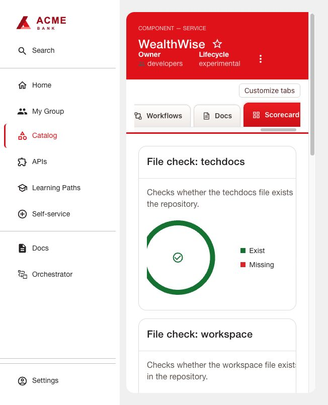

# RHDH Scorecard

Native Red Hat Scorecard frontend/backend and Jira/File Check modules, qualified
version 2.7.9. This gives an application readiness view without a DX tenant.

1. Prepare Jira Cloud with a project and readable issues, and configure RHDH's
   Bitbucket URL reader for the actual application repository. File Check uses
   that reader, not the Jira credential or the catalog repository's files.
2. Follow [shared installation](../INSTALL.md) using all four package entries in
   `dynamic-plugins.json` and `app-config.yaml`. For the scoped Jira token setup,
   replace `YOUR_CLOUD_ID` with the site's cloud ID. The backend variable
   `JIRA_SCORECARD_TOKEN` contains base64 of `email:api_token` (the credential value,
   not the word `Basic`). Generate/store it privately. Ensure the token can read
   the project/issues selected by the filter.
3. Add to the Component:
   ```yaml
   jira/project-key: APP
   scorecard.io/enabled: 'true'
   backstage.io/source-location: url:https://bitbucket.org/WORKSPACE/APP/src/main/
   ```
   The `scorecard.io/enabled` marker controls this example's tab visibility only;
   it does not restrict backend collection or authorization. The tested deployment
   used a different presentation marker; this guide uses the matching generic marker
   in its supplied package wiring.
4. Register `scorecard` under RBAC `pluginsWithPermission` and grant the intended role
   `p, role:default/developer, scorecard.metric.read, read, allow`.
5. Edit File Check paths and Jira filter in `app-config.yaml` to match your project.
   This profile collects `Jenkinsfile`, `devfile.yaml`, `mkdocs.yml`, `docs/secrets.md`
   and open High/Highest-priority issues every five minutes. Keep the Jira schedule
   under `jira.open_issues.schedule`; moving it up a level retains the hourly default.
6. Roll out RHDH, refresh the Component, wait one collection interval and open
   **Scorecard**. Compare issues against Jira and files against the source branch.

The Jira endpoint reports an approximate count. Thresholds are success `<1`, warning
`1-2`, error `>2`; full numeric coverage is required by the validator. File existence
is not proof of successful builds, workspace startup, TechDocs publication or secret
rotation. This is an application scorecard, not a portal-wide aggregate.

[Red Hat Scorecards](https://docs.redhat.com/en/documentation/red_hat_developer_hub/1.9/html-single/evaluate_project_health_using_scorecards/index)


