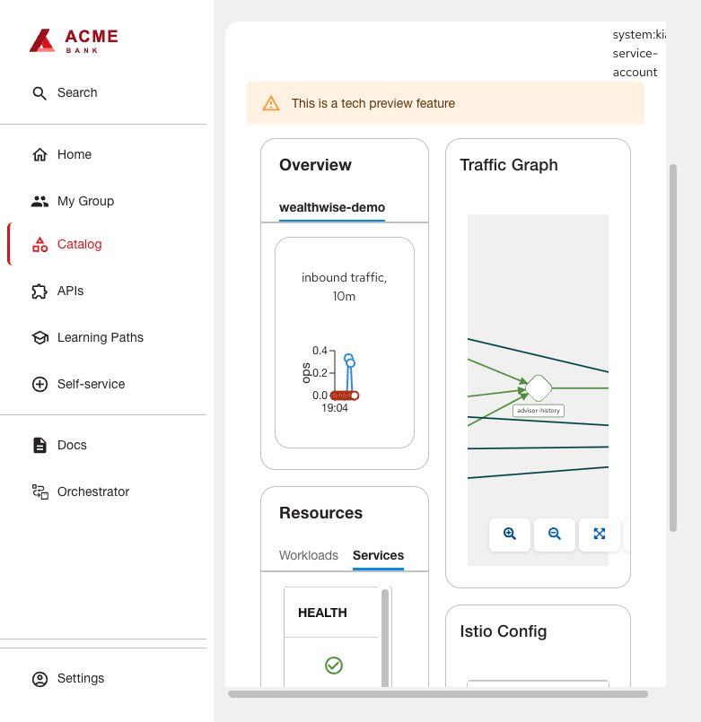

# Service Mesh / Kiali

The native Kiali tab displays workloads and an interactive observed-traffic graph.
The independent compact card summarizes namespace enrollment/TLS. The native tab
is Tech Preview; narrow embedded browser panes constrain its two-column layout.

## Shared foundation

1. On OpenShift install **Red Hat OpenShift Service Mesh 3** and **Kiali Operator**
   from OperatorHub. Qualified versions: Service Mesh Operator 3.4.2, Kiali 2.27.4,
   Istio/CNI 1.30.4. Use manual install-plan approval and review the resolved versions.
   Wait for the operators and `sailoperator.io`/`kiali.io` CRDs before applying CRs.
2. Review [foundation.yaml](foundation.yaml). It contains namespaces, Istio/CNI,
   namespace-scoped metrics, view-only Kiali and a small compatibility proxy. Replace
   `example-app` with an existing application namespace and `rhdh` with your portal
   namespace throughout. `mesh-system`, revision `mesh` and `istio-cni` can be retained
   or renamed consistently. Never overwrite an existing unrelated control plane.
3. The metrics Deployment pins the Prometheus image used on the qualified cluster.
   On a different OpenShift release, use the appropriate supported Prometheus image
   and revalidate it. Metrics retain six hours/512 MB in temporary storage; choose
   persistent storage separately if history must survive pod replacement.
4. Apply the reviewed resources (`oc apply -f foundation.yaml`). Wait for Istio and
   IstioCNI Ready, then metrics, Kiali and adapter Deployments Available. The
   application namespace must exist before its Role/RoleBinding can be created.
   Kiali discovery and metrics reads are limited to the two named namespaces.
5. The included additive NetworkPolicy permits metrics scraping only. Because an
   ingress policy isolates its selected pods, retain explicit application ingress
   policies before applying it; otherwise normal service traffic can be blocked.
   Ensure application NetworkPolicies allow mesh control-plane communication and
   Prometheus scraping of proxy port 15090. Permit the metrics pod from `mesh-system`
   to injected pods; retain application ingress rules. The adapter policy admits
   only the RHDH namespace. It has no external route or Kubernetes token.

## Enroll application services and software templates

1. Merge [enrollment.yaml](enrollment.yaml) fragments into Git-managed manifests:
   label the namespace for discovery, set the selected pod templates' Istio revision,
   hold application startup for the proxy, and name HTTP Service ports. Do not inject
   databases, build jobs or unrelated utilities merely because they share a namespace.
2. Let Argo CD reconcile (or apply using the existing workload manager). Confirm
   ready `istio-proxy` containers; with native sidecars these may appear under
   `initContainerStatuses`. Test actual service-to-service requests.
3. In an RHDH software template add an opt-in boolean, e.g. `meshEnabled`, default
   false. When true, render those namespace/pod/Service fields plus the catalog
   annotations below. Preserve the existing non-mesh output when false. The shared
   mesh is installed once by the platform administrator, not by each template run.
   [Template input fragment](template-snippet.yaml) and
   [conditional pod fragment](pod-template.yaml.njk) show the rendering contract.
   Merge them into the existing complete template/skeleton, keep unrelated fields,
   and conditionally emit the two Kiali catalog annotations with the same boolean.
4. Keep Jenkins tests/security gates before publishing. Write the approved immutable
   image digest to the rendered GitOps deployment; have an Argo Application or
   ApplicationSet select that path. The tested template generated an adviser service
   sharing the existing namespace/history backend, not an entire second banking app.
5. Test a fresh template run through repository creation, Jenkins success, Argo
   Synced/Healthy, ready proxy and an actual request. An injection label alone is
   insufficient acceptance.

## Portal configuration and named-revision adapter

Follow [shared installation](../INSTALL.md) with `dynamic-plugins.json` and
`app-config.yaml`. Qualified Kiali exports: frontend 1.50.2/backend 1.29.1 for
Backstage 1.49.4. Add to the Component:

```yaml
kiali.io/provider: default
kiali.io/namespace: example-app
```

The deployed native backend requests `/api/mesh/tls` without an Istio revision.
For a named revision, that failed during qualification. `kiali_compat.py` and its
embedded ConfigMap in `foundation.yaml` add `revision=mesh` only for that endpoint;
other responses are forwarded unchanged. The adapter verifies Kiali's OpenShift
service certificate using the injected CA and does not log requests or credentials.
Set `ISTIO_REVISION` to the actual revision. If modifying the Python source, also
update the ConfigMap's `server.py` and restart its Deployment. Remove this adapter
only after testing an upstream plugin that handles your revision directly.

Generate a bounded Kiali reader credential from the operator-created account:
`oc -n mesh-system create token kiali-service-account --duration=168h`.
Store it privately as backend variable `KIALI_SERVICE_ACCOUNT_TOKEN` using the shared
guide. The requested lifetime is seven days; honor the actual issuer expiry and
renew/restart RHDH before it expires. Do not expose it in catalog YAML or the UI.

## Verify and troubleshoot

Generate bounded application requests, wait a metrics scrape interval, then open
**Service Mesh**. Check the namespace, ready workloads and traffic graph; zoom/fit
controls are interactive. An idle dependency may not appear in the recent window.
Use Prometheus `istio_requests_total` labels to verify `connection_security_policy`
for observed calls. Automatic mTLS enabled and an UNSET/unenforced TLS policy are
compatible: this setup does not enforce STRICT mTLS. No distributed tracing,
gateway migration or canary rollout is installed by this guide.

401: renew the reader credential. Missing namespace: check Kiali discovery/RBAC.
Empty graph: check traffic, scrape targets and 15090 NetworkPolicy. Revision error:
check adapter revision/upstream/CA. Stale metrics after a pod restart are expected
with the temporary six-hour metrics store.

Optional summary: [Application Overview mesh card](../../plugins/application-health/README.md#service-mesh--kiali).


