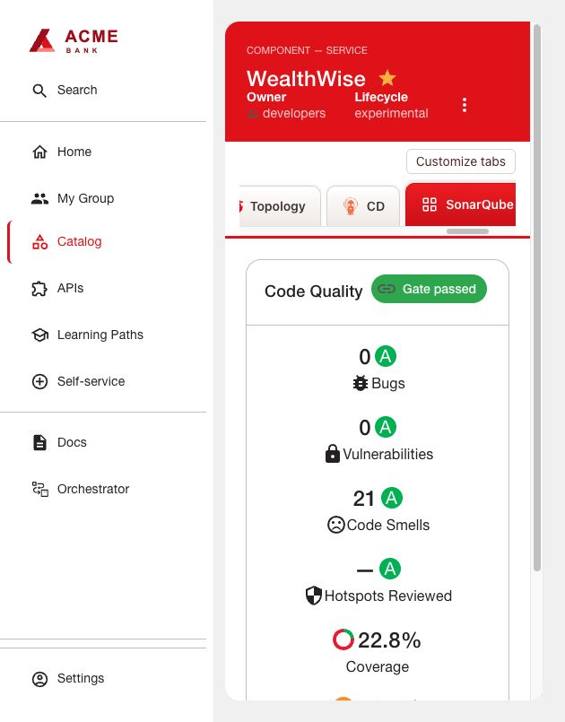

# SonarQube

The native community tab shows project analysis. Jenkins runs analysis and enforces
the quality gate before image publication. The optional overview card is separate.

## Prepare the server and Jenkins

1. Use an existing SonarQube server or install Community Build with its official
   Helm chart version **2026.5.1001**. The working baseline used Community Build 26.9.0.129388, a PostgreSQL
   database, persistent storage and the [OpenShift values](helm-values.yaml).
   Those values require a reachable `sonar-db:5432` database, database/user `sonar`,
   and a Secret `sonar-bootstrap` containing `database` (DB password) and `monitoring`
   (monitoring passcode). Provision these before Helm installation. Adjust storage
   class and capacity; allow at least the configured 4 GiB application request plus
   database memory and two 10 GiB volumes.
   Create namespace `sonarqube`; save private env-file keys `database` and
   `monitoring`, then create the `sonar-bootstrap` Secret as described in shared
   installation. Apply [postgres.yaml](postgres.yaml) and wait for `sonar-db`.
   The cluster pull secret must permit the Red Hat PostgreSQL image.
2. Configure `vm.max_map_count=524288` before starting SonarQube. The supplied
   [tuned.yaml](tuned.yaml) targets only nodes you label `sonarqube-node=true`.
   Review it against existing Tuned profiles, label eligible nodes, apply it and
   confirm their active profile/sysctl. Add an equivalent node selector to the Helm
   values on multi-node clusters so SonarQube lands on configured nodes. The example
   disables privileged sysctl/fs init containers and does not create an SCC.
   Install the qualified chart after those prerequisites:
   ```sh
   helm repo add sonarqube https://SonarSource.github.io/helm-chart-sonarqube
   helm repo update sonarqube
   helm upgrade --install sonarqube sonarqube/sonarqube --version 2026.5.1001 \
     --namespace sonarqube -f helm-values.yaml --wait --timeout 10m
   oc -n sonarqube create route edge sonarqube --service=sonarqube-sonarqube --port=9000
   ```
   Use the resulting HTTPS route as the external UI URL. Retain the DB password
   with its PVC; changing a Secret alone does not rotate an initialized database.
3. Complete initial SonarQube administrator setup, create project `example-app`,
   select its quality gate and generate tokens for analysis and portal reads. Store
   tokens privately. The internal demo used bootstrap-account tokens; project keys
   and URLs must be replaced for another application.
4. Install Jenkins SonarQube Scanner plugin (qualified: `sonar:2.19.0`). Add the
   analysis token as a Secret text credential. Under Manage Jenkins → System →
   SonarQube servers, configure `Application SonarQube`, its backend URL and that
   credential. Add a shared webhook secret as `sonarqube-webhook` in Jenkins.
5. In SonarQube project webhooks, set
   `https://JENKINS_HOST/sonarqube-webhook/` with the same shared secret. Preserve
   the trailing slash and verify SonarQube can reach Jenkins.
6. Run Maven tests with JaCoCo coverage (qualified 0.8.15) and retain the XML report.
   Insert [Jenkins stages](Jenkinsfile.snippet) after tests and before publishing an
   image. The Maven scanner version used was 5.8.0.7211. Configure multi-module XML
   report paths if the scanner cannot discover them. A failed/unknown gate must
   stop publication; the RHDH card does not enforce this.

## Configure RHDH and verify

Follow [shared installation](../INSTALL.md) with `dynamic-plugins.json`,
`app-config.yaml` and backend variable `SONARQUBE_TOKEN`. Add the Component annotation
`sonarqube.org/project-key: example-app`, refresh it, then open **SonarQube**.

Compare the tab with the real analysis. Test a failing gate in a disposable project,
confirm publication is blocked, then fix it and confirm continuation. The default
Sonar way gate evaluates new code; passing it can coexist with old findings and low
overall coverage. A webhook timeout is not a passing gate.

Enable the optional `sonarqube` compact card through
[Application Overview](../../plugins/application-health/README.md).



[Official installation documentation](https://docs.sonarsource.com/sonarqube-server/server-installation)
