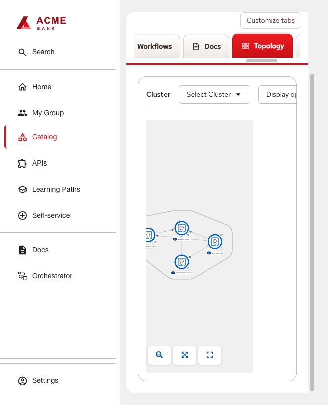

# OpenShift Topology

Source: Backstage Kubernetes plugins and community Topology plugin, distributed
as RHDH dynamic packages. Bundled package versions follow the RHDH image.

1. Follow [shared installation](../INSTALL.md) with `dynamic-plugins.json` and
   `app-config.yaml`. This example assumes RHDH runs in the observed cluster.
2. Replace namespace/service-account placeholders in [rbac.yaml](rbac.yaml) and
   apply it. It grants namespace reads and pod logs, not Secret reads. Repeat in
   each intended application namespace. Allow backend access through NetworkPolicies.
3. Ensure the RHDH pod has its service-account token and `kube-root-ca.crt` mounted
   at `/var/run/secrets/kubernetes.io/serviceaccount`. When automount is disabled,
   configure a projected volume with `serviceAccountToken` (path `token`, expiry
   3600) and the `kube-root-ca.crt` ConfigMap (key/path `ca.crt`) through your chart/CR.
   Mount it read-only. Set `NODE_EXTRA_CA_CERTS` to the CA path, or combine it with
   any existing custom CA bundle rather than replacing that bundle.
4. Add Component annotations:
   ```yaml
   backstage.io/kubernetes-id: example-app
   backstage.io/kubernetes-namespace: example-app
   ```
   Set `backstage.io/kubernetes-id: example-app` as a label on each selected
   Deployment, Service and pod template. Labels must match the catalog value.
5. Add workload annotations such as
   `app.openshift.io/connects-to: '[{"apiVersion":"apps/v1","kind":"Deployment","name":"history"}]'`
   to describe the actual dependencies. These edges are declared relationships,
   not measured traffic. Use Kiali for measured mesh traffic.
6. Register `kubernetes` in RBAC `pluginsWithPermission`; grant the intended role:
   ```csv
   p, role:default/developer, kubernetes.clusters.read, read, allow
   p, role:default/developer, kubernetes.resources.read, read, allow
   ```
   The optional pod-log viewer also requires
   `p, role:default/developer, kubernetes.proxy, use, allow`. This permits proxy
   requests within the backend service account's Kubernetes RBAC, not just UI logs.
7. Roll out RHDH, refresh the entity and open **Topology**. Confirm the expected
   workloads, resource drawer, route and (if enabled) logs. A blank graph usually
   indicates unmatched labels, namespace filtering, RBAC or missing CA/token mounts.

CPU/memory metrics lookup is disabled in this example. It shows resources and pod
state. No custom Topology package or compact card is required.


