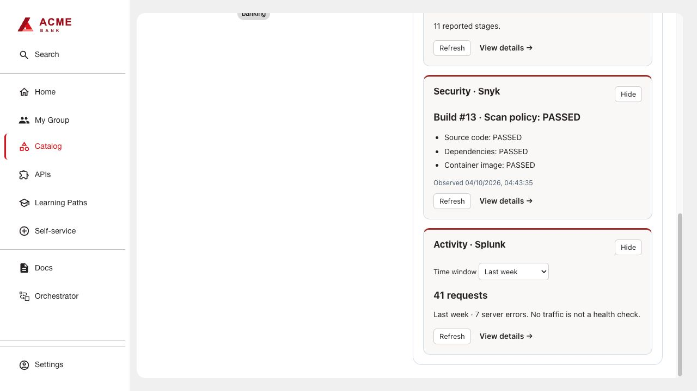

# Application Overview

Optional, frontend-only summary cards for independently installed Vault, Jenkins,
Snyk and Splunk integrations. It has no backend and owns no Vault configuration.
Each card loads independently: a missing or failing backend makes only that card
Unavailable. Hidden and disabled cards do not poll. No provider is a package dependency.

## Build and install

```sh
bash scripts/build.sh application-health
```

Use Node 24. The command produces one frontend
archive in `artifacts/application-health/0.3.0/`. Publish it and use the generated
integrity-pinned `dynamic-plugins.yaml`. See [build instructions](../../docs/BUILDING.md).
Apply [frontend configuration](examples/app-config.yaml) and the generated mount
point wiring. `applicationHealth.enabledCards` defaults to an empty list: list only
installed integrations. A card also requires its matching entity annotation.
`applicationHealth.detailTabs` independently controls links; omit an integration
when its backend is installed but its detailed frontend tab is not.
These settings declare available integrations; they do not auto-detect installed packages.

Manage cards hides or restores configured cards for the signed-in user and entity
in this browser. It does not change permissions. A missing backend is shown as
Unavailable without preventing the remaining cards from loading.
Splunk defaults to seven days and supports a time-window selector.



