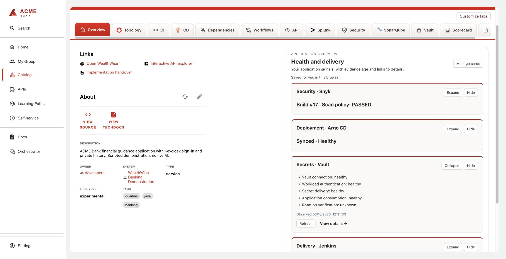
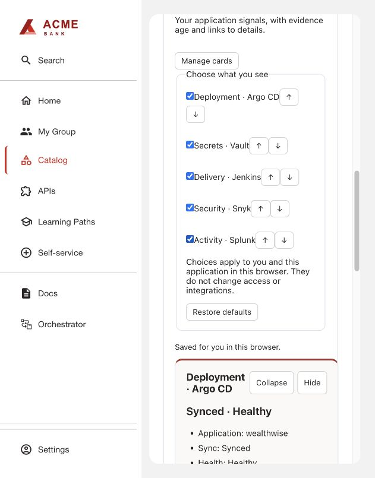
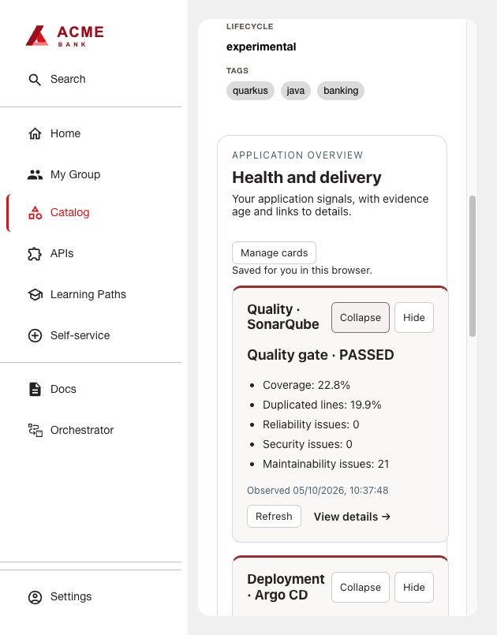
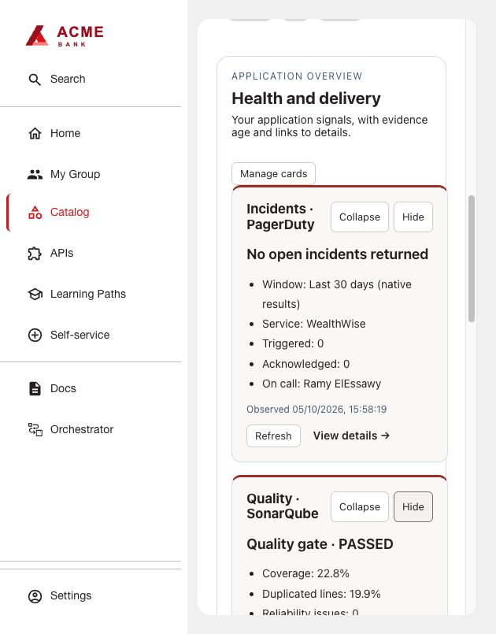
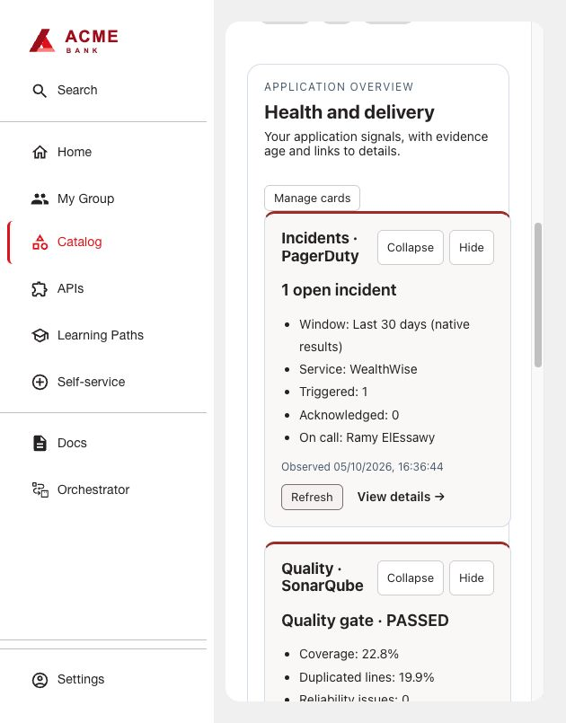
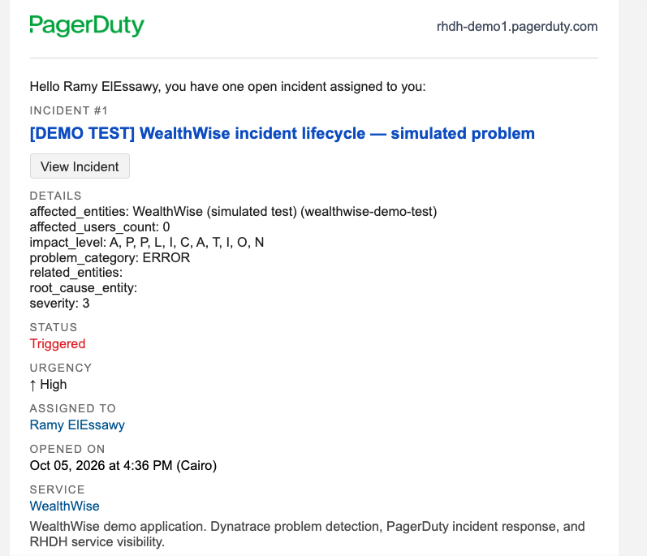
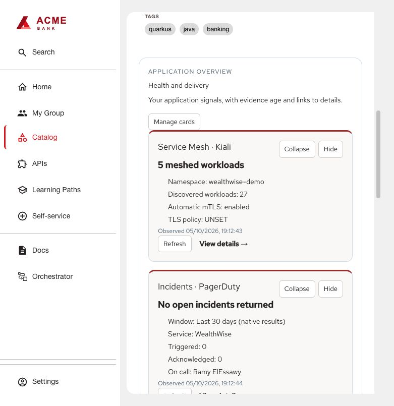

# Application Overview

Optional, frontend-only summary cards for independently installed Vault, Jenkins,
Snyk, Splunk, Argo CD, SonarQube, PagerDuty and Service Mesh / Kiali integrations. It has no backend and owns no Vault configuration.
Each card loads independently: a missing or failing backend makes only that card
Unavailable. Hidden and disabled cards do not poll. No provider is a package dependency.

## Build and install

```sh
bash scripts/build.sh application-health
```

Use Node 24. The command produces one frontend
archive in `artifacts/application-health/0.7.0/`. Publish it and use the generated
integrity-pinned `dynamic-plugins.yaml`. See [build instructions](../../docs/BUILDING.md).
Apply [frontend configuration](examples/app-config.yaml) and the generated mount
point wiring. `applicationHealth.enabledCards` defaults to an empty list: list only
installed integrations. A card also requires its matching entity annotation.
`applicationHealth.detailTabs` independently controls links; omit an integration
when its backend is installed but its detailed frontend tab is not.
These settings declare available integrations; they do not auto-detect installed packages.

Manage cards hides/restores cards and moves them up or down. Each card can be collapsed
or expanded. Visibility, order and collapsed state are saved for the signed-in user
and entity in this browser; Restore defaults resets all three. Existing hidden-card
preferences are preserved. Collapsed cards continue refreshing their status. It does not change permissions. A missing backend is shown as
Unavailable without preventing the remaining cards from loading.
Splunk defaults to seven days and supports a time-window selector.





## Argo CD

Enable `argocd` in `applicationHealth.enabledCards` after installing the native
Argo CD backend. Set the entity annotations `argocd/app-name` and
`argocd/instance-name` to match the application and configured backend instance.
Optionally set `argocd/app-namespace` for namespaced applications. The card shows
individual sync and health status, revision and resource count; it never triggers a sync.
Enable `argocd` in `detailTabs` when the CD page is installed. The backend discovery
ID defaults to `argocd`; set `applicationHealth.argoBackendId` if yours differs.
The existing Argo backend authentication and read permissions apply. No token is
passed to the browser by this plugin. A missing backend affects only this card.

## SonarQube

Install the community SonarQube backend (`sonarqube`) and optionally its frontend
in RHDH. Configure the backend's SonarQube URL and API token server-side; add
`sonarqube.org/project-key` to the component. Enable `sonarqube` in
`applicationHealth.enabledCards`, and in `detailTabs` when a `/sonarqube` tab is
installed. Named instances use `instanceName/projectKey` in the annotation.

The card uses the native backend's findings API to show the quality gate,
coverage, duplication and issue counts, with the analysis timestamp. Missing
metrics are omitted; an absent gate is Unknown, never Passed. A missing backend
only affects this card. No SonarQube token reaches the browser.

The gate is configured in SonarQube: the default new-code gate can pass while
existing overall-code findings remain. Jenkins must enforce its quality gate
before publishing; this read-only card does not enforce pipeline policy.



## PagerDuty

Install the native PagerDuty backend (discovery ID `pagerduty`) and configure its
API token server-side. Add `pagerduty.com/service-id` to the component, and enable
`pagerduty` in `applicationHealth.enabledCards`. For named accounts also set
`pagerduty.com/account`. Add `pagerduty` to `detailTabs` if the native frontend is
mounted at `/pagerduty`.

The card shows open incident counts from the native backend’s recent incident page
(last 30 days), triggered/acknowledged counts and the current
on-call responder from the service's escalation policy. It does not create,
acknowledge or resolve incidents and works with a read-only PagerDuty API key.
A failing or absent native backend affects this card only. Configure monitoring
event delivery separately in Dynatrace or your monitoring provider.



### Incident lifecycle validation

On 5 October 2026, a labelled simulated ACTIVE problem event executed through the
Dynatrace workflow created a real PagerDuty incident and the overview showed one
triggered incident. The matching CLOSED event resolved the same incident, and the
RHDH overview returned to zero open incidents. Both workflow executions succeeded.
The alert notification was also received by the assigned responder.

This verifies workflow delivery, incident correlation, recovery and RHDH visibility.
Automatic detection of an actual application failure has not yet been tested.
The detailed PagerDuty tab is supplied by the native plugin; this repository adds
the compact overview card and product icon.





## Service Mesh / Kiali

Install the native community Kiali frontend and backend and configure a Kiali provider.
Set `kiali.io/provider` and `kiali.io/namespace` on the component. Enable `mesh` in
`applicationHealth.enabledCards`; include it in `detailTabs` when the detailed view
is mounted at `/mesh`. The card reads the native `kiali` backend. It does not require
a collector or grant additional Kubernetes access.

The card shows namespace workload counts, sidecar presence and reported TLS policy.
These are namespace-level observations, not proof that every request used mTLS or
that every workload is healthy. Automatic mTLS and enforced STRICT policy are
different settings. A missing Kiali backend affects only this card. Existing hide,
collapse and ordering preferences apply.




