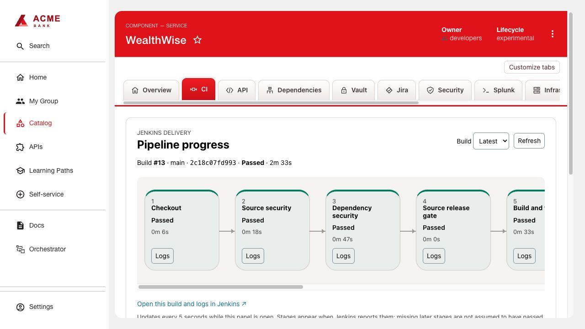

# Jenkins Stage Progress & Logs

Shows pipeline stages, status, duration, a selector for the ten most recent builds,
and on-demand stage logs in a catalog component's **CI** tab. Progress refreshes every five seconds. The
frontend calls `/api/ci-progress`; the backend checks the signed-in user's catalog
access, resolves the configured job mapping, then reads Jenkins.
The stock Jenkins RHDH plugin is optional; this panel works independently of it.

## Prerequisites

- RHDH with authenticated users, a working catalog and dynamic frontend/backend plugin support.
- Jenkins Pipeline jobs with named stages and **Pipeline: REST API** installed.
- A Jenkins username/API token restricted to Overall/Read and Job/Read for the
  mapped jobs (including access through their folders). No build/admin permission.
- Backend network access to Jenkins, browser access to its public URL and trusted
  TLS certificates. Use HTTPS; HTTP should only be used on an explicitly trusted
  internal network. For a private CA, mount its PEM file and set
  `NODE_EXTRA_CA_CERTS` for the RHDH backend; never disable certificate verification.

## Configuration

Merge [app-config.yaml](examples/app-config.yaml) and inject these backend variables
through the deployment's Secret/environment configuration:

| Variable | Value |
|---|---|
| `JENKINS_URL` | Backend-reachable Jenkins base URL, including any context path |
| `JENKINS_PUBLIC_URL` | Browser-reachable Jenkins base URL |
| `JENKINS_USERNAME` | Read-only integration username |
| `JENKINS_TOKEN` | Its API token; keep in a Secret, never catalog metadata |

### Entity mapping

Add the annotation from [catalog-info.yaml](examples/catalog-info.yaml) to your
existing component. Add a corresponding **full entity reference** and job path to
`ciProgress.bindings` in backend configuration:

```yaml
ciProgress:
  # Keep the URL/credential settings from app-config.yaml.
  bindings:
    - entityRef: component:default/payments-api
      jobFullName: applications/payments-api/main
      branch: main
```

The annotation and job mapping must match. Use folder/job names, not `/job/` URL
syntax. Nested folders and branch jobs are supported; `branch` is a display label.
Readers of a bound catalog component can view its mapped build logs through the
shared Jenkins identity: configure catalog permissions accordingly. Changing a
catalog annotation alone cannot grant access to a different job.

## Installation

```sh
bash scripts/build.sh jenkins-stage-progress
```

Follow the [common build/install instructions](../../docs/BUILDING.md) to host the
two archives and apply generated `dynamic-plugins.yaml`. Use
[deployment fragments](examples/deployment.yaml) for Secret and configuration references.

## Usage

Open a bound component's **CI** tab. Select a retained build to see stage status
and duration in connected, horizontally scrollable stage nodes. Choose **Logs**, select a step and refresh its output. Progress
refreshes every five seconds; the full console link opens Jenkins.

## Screenshot



## Troubleshooting

- Missing tab: check frontend install logs, generated wiring and the annotation.
- 401: RHDH sign-in required. 403: catalog access or exact job mapping mismatch.
- Unavailable: check Jenkins token, permissions, TLS/network access and `wfapi`.
- No stages: verify this is a Pipeline job and Jenkins reports named stages.

## Limitations

- One configured Jenkins server; ten newest retained builds; 100 stages maximum.
  It displays reported stage order, not a full parallel-pipeline graph. Stages that
  Jenkins has not reported are not treated as passed. Commit can be unavailable
  for SCM plugins that do not expose `lastBuiltRevision.SHA1`.
- Logs are plain text, limited to 65,536 characters; full console opens Jenkins.
  Pipeline credential masking remains essential. Jenkins permission changes for
  individual developers are not mirrored: the integration uses its shared reader.
- Backend ID is `ci-progress`; install only one backend with that ID.
  No Snyk, Jira, Splunk, Bitbucket or application dependency.
- To uninstall, remove these two entries and configuration, then roll out RHDH.
  No database, CRD or persistent volume is created by this plugin.

References: [RHDH 1.10 dynamic plugins](https://docs.redhat.com/en/documentation/red_hat_developer_hub/1.10/html/develop_and_deploy_dynamic_plugins_in_red_hat_developer_hub/deployment-configurations_develop-and-deploy-plugins-in-rhdh),
[RHDH frontend wiring](https://github.com/redhat-developer/rhdh/blob/release-1.10/docs/dynamic-plugins/frontend-plugin-wiring.md),
[Jenkins Pipeline REST API](https://plugins.jenkins.io/pipeline-rest-api/).
