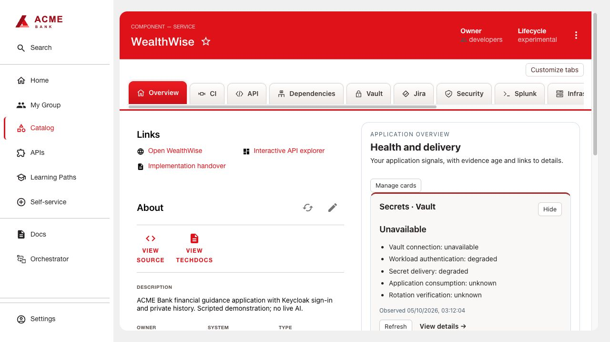
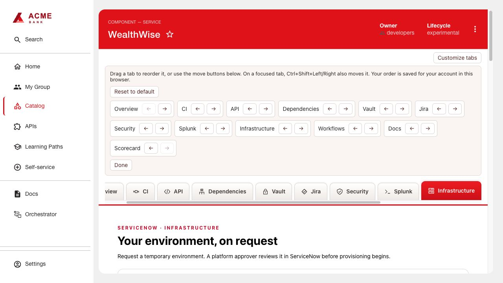
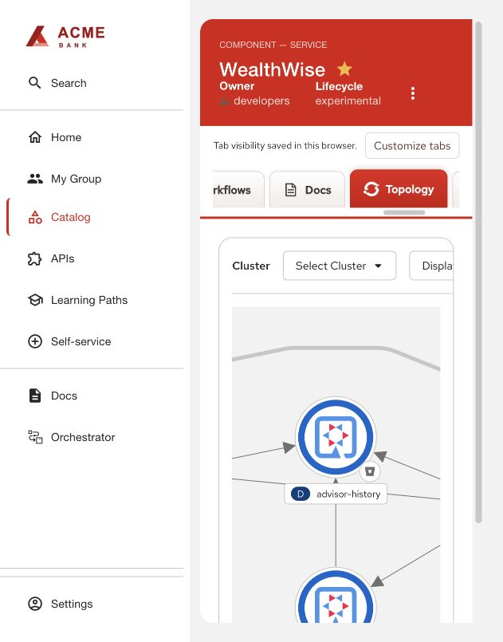
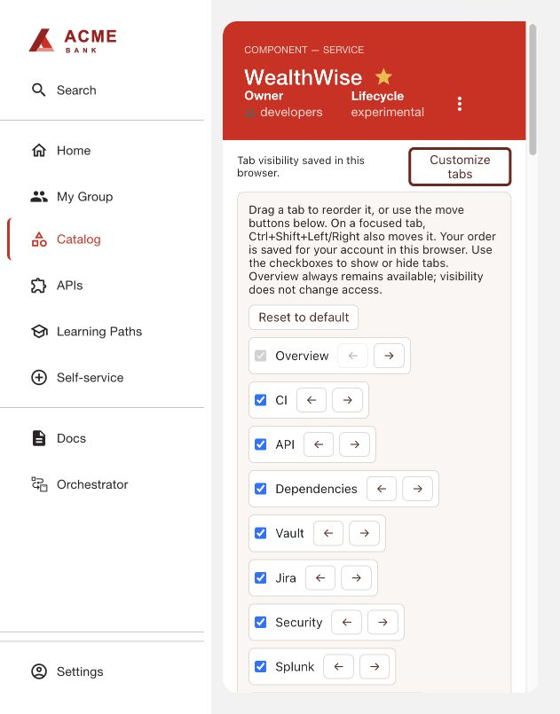

# Portal Appearance

Raised catalog entity tabs in the ACME red palette: rounded upper corners, subtle
shadows, a red selected tab, pale hover state and visible keyboard focus.
This independent frontend extension adds no API, credentials or dependencies on
Jenkins, Snyk, Vault or the overview cards.

## Build and install

1. Use Node 24, npm and tar. From this repository run:
   ```sh
   bash scripts/build.sh portal-appearance
   ```
2. Serve the generated archive from `artifacts/portal-appearance/0.4.0/` over HTTPS.
3. Copy the generated `dynamic-plugins.yaml` package entry into your RHDH dynamic
   plugin configuration, replace its example URL with your archive URL, and retain
   its generated integrity value. The entry includes the `application/header`
   wiring in [frontend-wiring.yaml](examples/frontend-wiring.yaml).
4. Roll out RHDH and open a catalog component. Check Overview, CI and Docs navigation,
   keyboard focus and horizontal scrolling at your normal viewport.

The plugin reads the actual entity routes exposed by the portal shell and presents
an icon-labelled tab strip. Drag tabs with a mouse to reorder, or open
**Customize tabs** and use the move buttons (also available on touch devices). **Reset to default** restores the
shell order. Arrow keys move focus; Enter opens a tab; Ctrl+Shift+Left/Right
reorders the focused tab. Home/End focus the first/last tab.

Preferences are scoped to the signed-in RHDH user and saved in browser localStorage.
They survive refresh and signing back in on that browser; they do not synchronize
across devices. Clearing browser storage resets them. The order applies across
catalog entities; absent plugins are omitted and new tabs append in shell order.
No secret or credential is stored. If storage is blocked, reordering is session-only.

A narrow shell adapter inserts a React-owned navigation sibling and hides the
native tab strip while mounted. It reads native links without moving/removing
React-owned nodes or changing plugin content. Unmount restores native navigation.
The adapter depends on the RHDH shell structure.

To change the palette or spacing, edit `frontend/src/index.tsx` and rebuild.
To remove the styling, remove the package and its frontend mount configuration,
then roll out RHDH. This integration targets the legacy RHDH entity header's
`header-tab-*` test IDs and Material UI tab wrapper; recheck after RHDH upgrades.





CD, Splunk, Jira and ServiceNow use bundled brand logos. Infrastructure is labelled
ServiceNow while keeping its `/infrastructure` route and saved ordering intact.
See [brand asset attribution](BRAND-ASSETS.md).



All tab icons use a uniform 20 × 20 px box. Brand SVGs retain their aspect ratio
and transparent background, without a surrounding tile or padding.

Customize tabs also provides show/hide checkboxes. Hidden tabs remain in the editor
so they can be restored, and Reset to default restores both visibility and order.
Overview cannot be hidden. Hiding the current tab returns to Overview; bookmarks
and permissions are unchanged. Topology uses the OpenShift logo.


