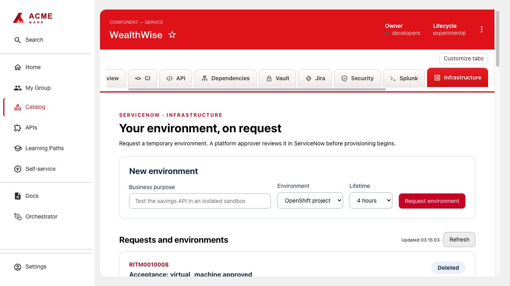

# ServiceNow Infrastructure

Request temporary OpenShift environments from an RHDH component, follow ServiceNow approval and provisioning, and open or delete a ready environment.

## Install

1. Use Node 24 and run `bash scripts/build.sh servicenow-infrastructure` from this repository. The command produces frontend and backend archives.
2. Publish the archives in `artifacts/servicenow-infrastructure/0.1.0/` to your HTTPS package host. Replace the example URLs in its generated `dynamic-plugins.yaml`, keeping the integrity hashes. Add those entries to your RHDH dynamic-plugin configuration.
3. Add the configuration below to RHDH app-config. Supply the token through a backend Secret. The frontend receives only the component allowlist.

```yaml
serviceNowInfrastructure:
  bridgeUrl: http://your-infrastructure-adapter:8080
  bridgeToken: ${SERVICENOW_BRIDGE_TOKEN}
  entities:
    - component:default/payments-api
```

4. Include `examples/frontend-wiring.yaml` (also embedded in the generated install file) and restart RHDH. Open the component’s **Infrastructure** tab as an authenticated user.

## Required workflow service

Follow [ServiceNow and workflow setup](services/README.md) to request a PDI,
configure the catalog and approval rules, install the Orchestrator runtime, and
deploy the included adapter. OpenShift Virtualization is optional for the VM target.
The project target needs only OpenShift. The adapter stores request state and
performs approval checks, provisioning and expiry cleanup.

No Jenkins, Snyk, Vault or Application Overview plugin is required. RHDH authenticates the user and checks catalog access to an allowlisted component before forwarding its identity; the UI does not have an approve action. The adapter uses a shared PDI identity, so ServiceNow audits API operations under that identity.

## Adapter contract

All calls use `Authorization: Bearer <backend token>` and JSON. Redirects are rejected.

| Endpoint | Purpose |
|---|---|
| `GET /requests?entity=<component-ref>` | Return `{requests: [...]}` for the component |
| `POST /start` | Accept `entity`, `actor`, `purpose`, `targetKind` (`project` or `virtual_machine`) and `hours` (1, 4, 8, 24); return the request with HTTP 202 |
| `POST /teardown` | Accept request `id`, `entity`, `actor`; delete only the bound environment using ownership and UID checks |

Request records contain `id`, `number`, `purpose`, `targetKind`, `approval`, `fulfillment`, `status`, `expiresAt`, `url`, and optional `output`/`resourceUrl`. Never return credentials. After an uncertain submission, refresh and reconcile before creating another request.

## Usage

Open the component’s **Infrastructure** tab, enter a purpose, select an environment
kind and duration, then submit. The request waits for approval in ServiceNow.
Follow its approval and provisioning status in RHDH; when Ready, open the environment
or delete it. Approval is performed in ServiceNow, not in this tab.


