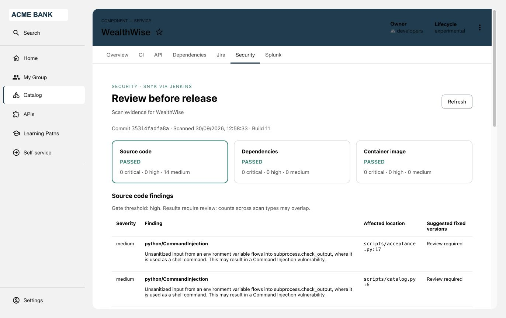

# Snyk Security

Review source code, dependency and container-image security together in a catalog
component's **Security** tab. Scan-policy results, severity counts, findings, commit,
build number and scanned archive hash help developers decide what needs attention
before release. Stale, missing and failed scans are visibly distinct from passes.

## Architecture and prerequisites

```text
Jenkins pipeline -> Snyk CLI -> normalized scan reports -> report.json artifact
RHDH Security tab -> authenticated backend -> catalog access + entity binding
                                        -> Jenkins metadata and report artifact
                                        OR read-only mounted report.json
```

No Snyk REST API access is required. The Snyk token stays in the pipeline's Jenkins
Secret Text credential. RHDH needs only a Jenkins reader credential, or a mounted
report. Neither the Jenkins Stage Progress plugin nor any other plugin in this
repository is required. Both frontend and backend Snyk packages must be installed.

- Target RHDH **1.10.4**, authenticated users and catalog authorization.
- Jenkins with Pipeline, Credentials Binding, SCM checkout metadata exposing
  `lastBuiltRevision.SHA1`, and archived artifacts. Jenkins **2.568.3** is the
  service baseline. A reader needs Overall/Read and Job/Read on mapped folders/jobs
  and permission to download their artifacts; no build or administration rights.
- Pipeline agent: Python 3, a pinned Snyk CLI, and tools required by the application
  (the example uses Maven). Snyk Code must be enabled; the account must permit
  source, dependency and container CLI scans within its usage limits.
- RHDH backend network access to Jenkins; scanner network access to Snyk.
  Use trusted HTTPS certificates. HTTP is permitted for explicitly trusted internal
  networks. For private CAs, mount a PEM and set `NODE_EXTRA_CA_CERTS`; do not disable
  TLS verification. Jenkins public URL must be browser-reachable.
- Build tool versions and observed validation status: [validation](../../docs/VALIDATION.md).

## 1. Produce security evidence

Copy [pipeline scripts](pipeline/) into the application's `ci/security` directory.
Adapt [Jenkinsfile.example](pipeline/Jenkinsfile.example): set the entity reference,
Snyk organization, credential ID, agent label and image archive path. Supply the
application's image-build/publish scripts; they are deliberately application-specific.
Install the CLI in the agent image or tools directory and pin its version. Create
`snyk-cli-token` as a Jenkins Secret Text credential containing the Snyk token.

The example runs both source checks before the source gate, builds only after it
passes, scans an OCI archive, then checks the same archive hash before publishing.
It archives the combined report in `post/always`, including failed builds. The CLI
wrapper runs dependency discovery with `--all-projects`; restore dependencies/build
manifests first when required by the package manager. Adjust that command for
specialized multi-module builds. Do not grant untrusted pull requests access to tokens.

High and critical findings block by default (`--threshold=high`). All scan output
must be recognized; errors deny publication. Raw JSON artifacts can contain source
paths and code snippets: restrict Jenkins artifact access and retention accordingly.
See [report format](pipeline/REPORT-FORMAT.md) for fields and scanner normalization.

## 2. Build and install in RHDH

With Node 24, npm, Python 3 and tar:

```sh
bash scripts/build.sh snyk-security
```

Output: `artifacts/snyk-security/0.2.0/`, containing frontend/backend archives,
SHA256SUMS, package integrity values and generated `dynamic-plugins.yaml`.
Verify with `sha256sum -c SHA256SUMS` (macOS: `shasum -a 256 -c SHA256SUMS`).
Host both archives on an HTTPS artifact endpoint reachable by RHDH. Replace the
example package URLs in the generated YAML, preserving integrity hashes and wiring.

For Helm, merge plugin entries into `global.dynamic.plugins` and backend settings
into `upstream.backstage.appConfig`. For the Operator, put generated plugin YAML
in the ConfigMap referenced by `spec.application.dynamicPluginsConfigMapName` and
app configuration in `spec.application.appConfig.configMaps`. Preserve unrelated
plugins/configuration. Reference the credentials Secret using the
[deployment examples](examples/deployment.yaml), then roll out RHDH.

## 3. Configure and bind components

Merge [app-config.yaml](examples/app-config.yaml). Set `JENKINS_URL`,
`JENKINS_PUBLIC_URL`, `JENKINS_USERNAME`, `JENKINS_TOKEN` server-side through a Secret.
Add [catalog-info.yaml](examples/catalog-info.yaml)'s `snyk-security.io/binding`
annotation to the component. Its value must match the administrator's `bindingKey`.
An optional backend `annotationKey` selects another organizational binding annotation.
The tab is offered for components with the Snyk annotation or `jenkins.io/job-full-name`;
the backend still requires the exact configured binding and catalog access.

Each full entity reference maps explicitly to one `jobFullName` and artifact path.
Use folder/job names, not URL syntax; include the desired branch job in the path.
The backend resolves the last completed build once and verifies its number and
commit against the report. Failed builds are included; it never falls back to an
older successful report. Requests cannot choose another job or an arbitrary URL.

Alternatively, set `reportFile` to an absolute read-only mounted JSON file instead
of `jobFullName`. Mount it with your deployment's volume settings; omit `jenkins`
configuration if all bindings use files. The writer must update reports atomically
and prevent older builds from overwriting newer reports. RHDH does not write files.
Mounted reports do not require Jenkins credentials or network connectivity.

Catalog readers of a bound component can read its reports through the shared
integration identity. Apply catalog permissions accordingly. Do not put credentials
or report file paths in catalog metadata.

## 4. Verify

Sign in and open the component's Security tab. Compare all three scan categories,
counts, commit, build number and archive hash with the archived report. In Jenkins
mode verify the build link. Test a passing scan, a blocked scan and an incomplete
build. Refresh after a new completed build; ensure missing artifacts show unavailable
instead of retaining an earlier passing result. Check that anonymous users, catalog
access denials, unmapped components and mismatched annotations cannot read reports.



Snyk Security displayed for a component in Red Hat Developer Hub.

## Troubleshooting and limits

- Missing tab: check plugin install logs, frontend wiring and catalog annotation.
- 401: sign in. 403: catalog access or administrator binding mismatch.
- Unavailable: check Jenkins credentials, artifact path, TLS and report format.
  Missing SCM commit metadata or mismatched report identity fails closed.
- Scan errors: inspect restricted pipeline artifacts; check CLI authentication,
  enabled scan products, usage limits, manifests and dependency restoration.
- Reports are limited to 900 KB; first 200 findings per scan are displayed. Jenkins
  requests have a shared 20-second deadline; refresh is manual.
- Evidence older than 24 hours is labelled historical. Scan-policy passes do not
  establish publication/deployment success; build result is displayed separately.
- One Jenkins server, one configured branch/job per component, last completed build.
  Mounted-file mode has no automatic Jenkins freshness or build-link verification.
- Backend ID: `snyk-security`. Install only one backend with this ID. Frontend tab
  wiring can be changed if another integration already occupies `/security`.
- To uninstall, remove the two plugin entries, configuration, Secret references
  and optional report mounts, then roll out RHDH. Keep pipeline evidence as required.
