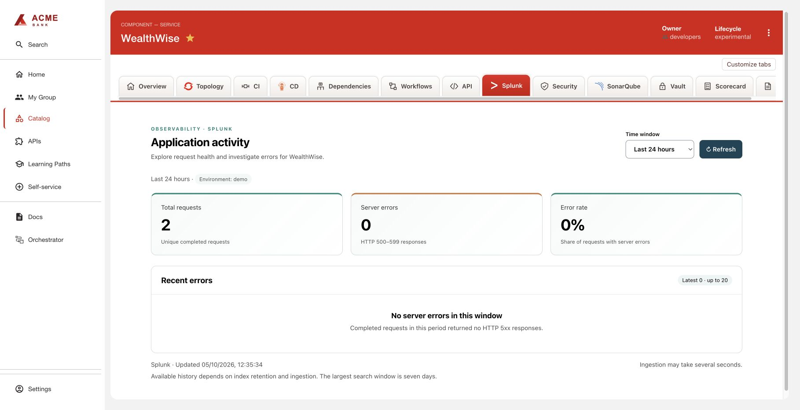

# Splunk Application Logs

Shows completed-request counts, HTTP 5xx counts, error rate and the latest 20
errors for a catalog component. Choose 5 minutes, 15 minutes, 1 hour,
6 hours, 24 hours or 7 days. The default is 24 hours; refresh is manual.

## Prerequisites

- RHDH dynamic frontend/backend plugin support, authenticated users and catalog access.
- A reachable Splunk HTTPS management API with `/services/search/jobs` support
  for `exec_mode=oneshot`, JSON results and the configured index.
- Structured request events matching [the event contract](ingestion/README.md).
  The dashboard does not ingest events or infer application instrumentation.
- Trusted server CA; optional custom TLS server name for internal DNS routing.
- For authenticated Splunk, a REST bearer token authorized to search only the
  required indexes. This is separate from the HEC token used by the collector.
  Omit `apiToken` only for a deliberately unauthenticated private Splunk Free
  instance. Restrict that management endpoint with network policy; never expose
  its unauthenticated search API publicly. No Splunk On-Call account is needed.

## Configuration

Merge [app-config.yaml](examples/app-config.yaml), replacing the endpoint and
bindings. For a custom CA, create [the trust ConfigMap](examples/trust.yaml), mount
`ca.crt` read-only at the configured path and set `serverName` to the certificate's
DNS name. If the endpoint uses public CA trust, omit `caFile` and `serverName`.
For authenticated search, populate `SPLUNK_API_TOKEN` through an RHDH Secret
reference and uncomment `apiToken`. Do not use a HEC token as the search token.
See [deployment fragments](examples/deployment.yaml) for Helm/Operator wiring.

### Entity mapping

Add [the catalog annotation](examples/catalog-info.yaml) to each component and an
exact full entity reference in backend `bindings`. Bind its index, service and
environment explicitly; a browser cannot supply search text or change that scope.
`annotationKey` optionally selects an organization's own binding annotation; adjust
frontend availability wiring when using a different catalog annotation.

Catalog readers can view mapped application metrics through the shared backend
identity. This does not mirror individual Splunk account permissions. The plugin
uses backend ID `splunk-logs`, independently of other custom integrations.

## Installation

```sh
bash scripts/build.sh splunk-logs
```

Follow the [common build/install instructions](../../docs/BUILDING.md) to host the
two archives and apply generated `dynamic-plugins.yaml`. Use
[deployment fragments](examples/deployment.yaml) for Secret and configuration references.

## Usage

Open the component's **Splunk** tab and choose a time window. Use **Refresh** to
retrieve request counts, error rate and recent error request IDs. An empty window
means no matching activity; an unavailable message indicates a connection or query
problem.

## Screenshot



## Troubleshooting

- No data: check ingestion, JSON field extraction, index/service/environment,
  `event_type=http_request_completed`, retention and selected time window.
- Unavailable: check management API reachability, CA/server name, token permissions
  and query errors. Invalid metric responses fail rather than displaying zero.
- Missing tab: check package loading, frontend wiring and binding annotation.
- 401 requires RHDH sign-in; 403 indicates catalog/binding denial; 429 means the
  per-process limit of four active summaries has been reached.

## Limitations

- Searches deduplicate on `request_id`; producers must use globally unique IDs.
  Metrics are two sequential searches, not an atomic snapshot. Only completed
  HTTP requests are included; error rate is not a full availability SLI.
- Responses are limited to 1 MiB per query. Large seven-day queries may time out.
  Index retention is configured in Splunk, not by choosing a dashboard window.
- RHDH reads data only. The optional collector retries without HEC acknowledgments;
  duplicates may occur and rotation can lose unread files. Use a production log
  collector when stronger delivery guarantees are required.
- To uninstall, remove both plugin entries, configuration and optional CA/Secret
  mounts, then roll out RHDH. Keep existing events according to retention policy.

API: [Splunk search jobs](https://help.splunk.com/en/splunk-enterprise/rest-api-reference/9.1/search-endpoints/search-endpoint-descriptions).
