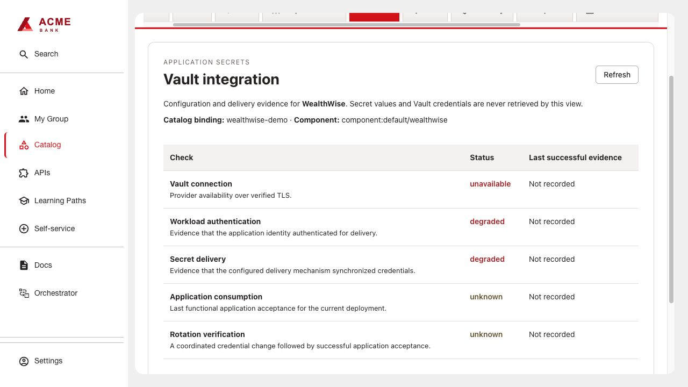

# Vault Health

Independent frontend and backend dynamic plugins. Install without Application Overview.
The Vault tab shows connection, authentication, delivery, consumption and rotation
checks. Secret values and Vault credentials are never retrieved by this plugin.

## Build and install

```sh
bash scripts/build.sh vault-health
```

Use Node 24. Both archives are written to `artifacts/vault-health/0.1.0/`.
Publish both archives and install the generated `dynamic-plugins.yaml` with its
integrity values. See [build instructions](../../docs/BUILDING.md).
Use [backend configuration](examples/app-config.yaml), mount the report ConfigMap
read-only, and add [the entity annotation](examples/catalog-info.yaml).
The backend API is `/api/vault-health/vault`; configuration is `vaultHealth.bindings`
and the annotation is `vault-health.io/vault-binding`.

## Collect health information

Deploy the [included VSO collector](collector/README.md) to write the JSON report
below into a ConfigMap. For another secret delivery mechanism, adapt its checks
and keep the same report format. Refresh the report at least once a minute.
Check authentication, delivery, application consumption and rotation separately:
Vault’s `/sys/health` endpoint establishes only Vault availability. Use `unknown`
for checks your collector cannot perform.

```json
{
  "schemaVersion": 1,
  "entityRef": "component:default/payments-api",
  "observedAt": "2026-10-04T00:00:00Z",
  "checks": {
    "connection": {"status": "healthy"},
    "authentication": {"status": "unknown"},
    "delivery": {"status": "unknown"},
    "consumption": {"status": "unknown"},
    "rotation": {"status": "unknown"}
  }
}
```

Status values: `healthy`, `degraded`, `unavailable`, `unknown`. Each check can include
`lastSuccessAt` as an ISO timestamp. The backend rejects invalid entity/timestamp
bindings and returns only the documented fields. A missing or invalid report
returns Unavailable. Refreshing the report does not establish that an application
login or secret rotation occurred; record those checks only when observed.



